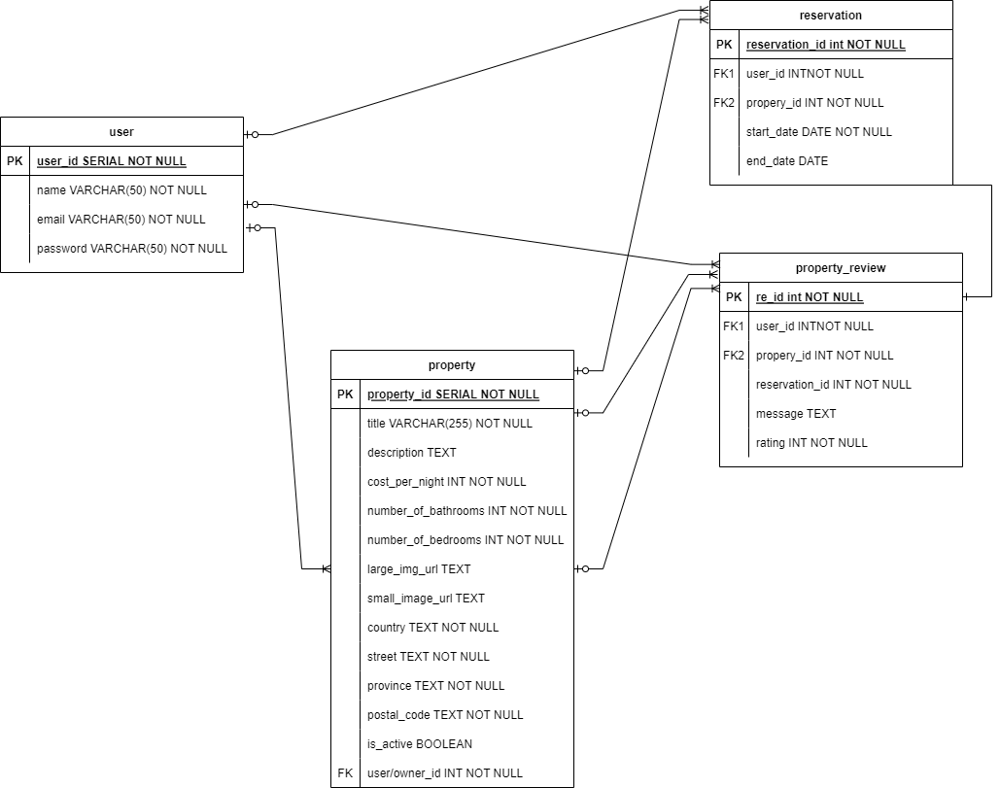

# LightBnb

A simple multi-page Airbnb clone that uses server-side Javascript to display information from to web pages vie SQL queries. 

# Installation

Clone repo and install npm dependencies. 

Use npm run local and navigate to localhost:PORT

## Features

This project let's you browse properties without logging in. Once logged in you can create listings, view reservations, and search available properties. 

## Database Structure

Below you can find an ERD to how the database is structured.

## Next Steps

The design is minimal on the front-end since this is a database focused project, so next steps would include doing some UX/UI work.

